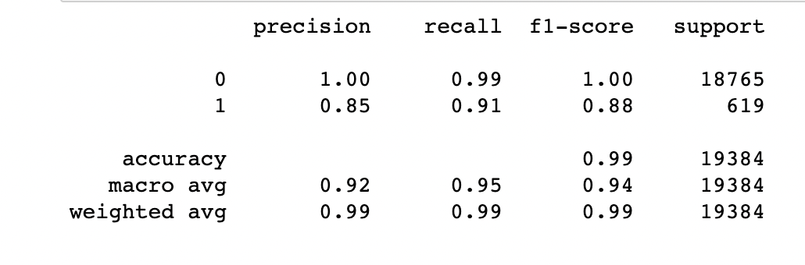
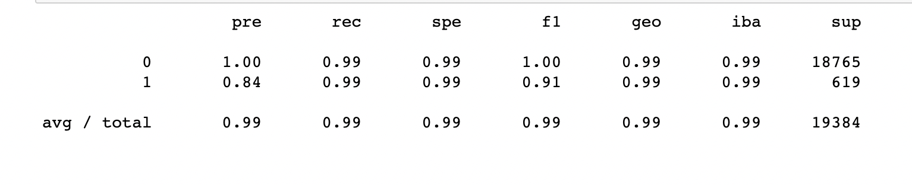

## credit_risk_resampling

The **credit_risk_resampling** uses various techniques to train and evaluate models with imbalanced classes. It uses a dataset of historical lending activity from a peer-to-peer lending services company to build a model that can identify the creditworthiness of borrowers.


---

## Technologies

This project leverages python 3.8.15 with the following packages:

* [pandas](https://pandas.pydata.org/) - For data analysis
* [scikit-learn](https://scikit-learn.org/stable/) - For Machine Learning in Python
* [imbalanced-learn](https://imbalanced-learn.org/stable/) -  For scikit-learn tools 


---

## Installation Guide

Before running the application first install the following dependencies in conda dev environment.

```python

    conda create -n dev python=3.8 anaconda

    python -m ipykernel install --user --name dev

    conda activate dev

    conda install pandas
    pip install -U scikit-learn==1.1.0   
    conda install -c conda-forge imbalanced-learn

    conda deactivate 
  
```

---


## Usage

To use the credit_risk_resampling application simply clone the repository and run the **credit_risk_resampling.ipynb** with jupyter lab:

```python
    conda activate dev

    jupyter lab

    conda deactivate 
```


Classification Report Using LogisticRegression



Classification Report Using RandomOverSampler




---

## Contributors

Kausar Hina

---

## License

MIT
